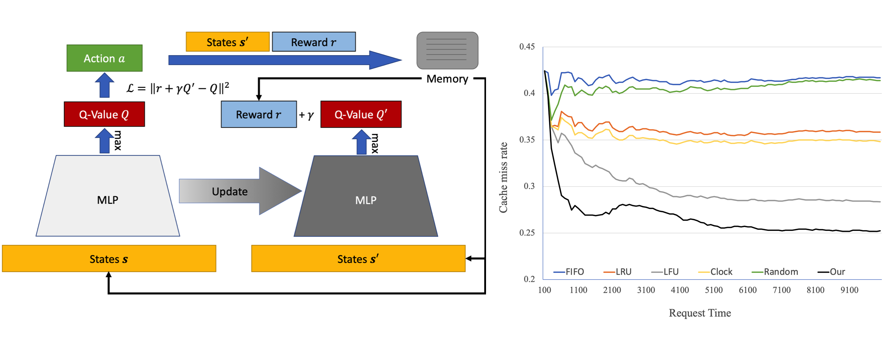

# Deep Reinforcement Learning-Based Cache Replacement Policy

## Introduction

We adopt a learning-based method to cache replacement strategy, aiming to improve the miss rate of existing traditional cache replacement policies. The main idea of modeling is to regard the strategy as a MDP so that we can employ DRL to learn how to make decision. We refer to Zhong et al. and design a similar MDP model. The learning backbone, however, is value-based DQN. Our main effort is to use short-term reward to optimize the long term miss rate, and further adopt the network content caching system to file system, testing the DRL agent with real-time disk activities.

In this work, in addition to the implementation code, we also prepared a piece of [slides](https://peihaowang.github.io/archive/Wang_DRL_Cache_2020_slides.pdf) and detailed [report](https://peihaowang.github.io/archive/Wang_DRL_Cache_2020_report.pdf).



## Code

To run the code for experiment, you should have at least the following dependencies installed. We tested our code using Python 3.6.

```
numpy
scipy
pandas
tensorflow
```

Note that this repo has not been well-organized yet. Please follow the instructions below for your own purpose or issues.

* Before you can run the code, please prepare the data and set the correct path in the relevant source files.

* If you want to recur our results, please directly run `run_this.py` with our fine-tuned hyperparameters.

* To integrate with your data loader, please refer to `Cache.py`. The current implementation only supports raw dataframe or `.csv` files.

* To implement your own learning and decision procedure, it is recommended to modify the code within `RLCache.ipynb` for better experimental environment.

## Dataset

The real-time data were collected via [Pintos](https://web.stanford.edu/class/cs140/projects/pintos/pintos_1.html) system. We inserted a piece of tracking code into the kernel and collect disk activities while running the systems in real-time. The dataset will be released here soon.

## Acknowledgment

The code for DQN was adapted from [Morvan Zhou's tutorials](https://github.com/MorvanZhou/Reinforcement-learning-with-tensorflow).

I sincerely appreciate the great efforts by the two co-workers below. We three equally contribute to this project.

1. [Yuehao Wang](https://github.com/yuehaowang)
2. [Rui Wang](https://github.com/RioReal)

Although we proposed this topic as an open question for CS181 final course project, we took it as serious scientific research in the intersected area of artificial intelligence and computer systems.
